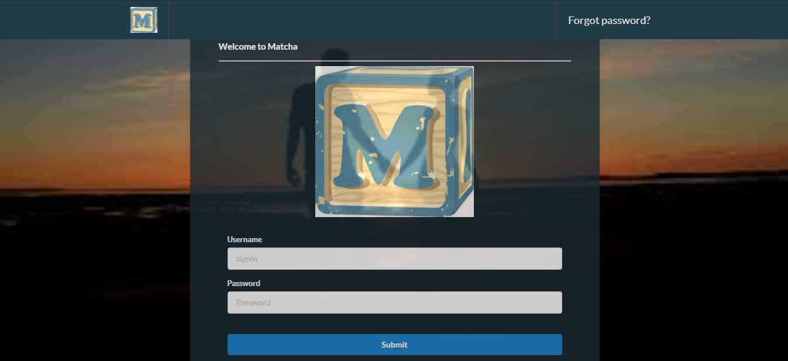

## Matcha
<p align="center">
  
</p>

The aim of this project is to create a dating website. The app allows two potential lovers to meet,
from the registration to the final encounter. A user should be able to register, connect, fill his/her profile, search and look into
the profile of other users, like them, chat with those that “liked” back.

## Table of contents
* [General info](#general-info)
* [Technologies](#technologies)
* [Installation](#installation)
* [App structure](#app-structure)

## General info
Matcha is one of the web based project that software engineering trainees do at WeThinkCode_. Only micro-frameworks are allowed to be used to build the application.
Object-relational mapping (ORM), validators or User Accounts Manager should not be used to create the application.
All forms must have correct validations and the whole website must be secure.

## Technologies
Technologies are used in this project:
* Express.js
* Node.js
* Embedded javascript template (ejs)
* Windows, Apache, MySQL and PHP (WAMP)

## Installation
To run this project locally, go to WAMP/apache2/htdocs then clone the git repository
```
$ git clone https://github.com/Sakhile-Msibi/Matcha.git
$ cd Matcha
$ npm install
$ npm start
```
Make sure that the correct credentials are written in the files in the config directory to be able to the apache2 web server and MySQL database.

## App structure
* Config - files used to configure the database
    * conn.js
    * database.js
* Public - CSS directory, images directory
* routes
    * block_user.js
    * catfish.js
    * chat.js
    * confirmation.js
    * forgot_password.js
    * home.js
    * index.js
    * loginchecker.js
    * message.js
    * notice.js
    * password_reset.js
    * profile_edit.js
    * profile.js
    * register.js
    * search_user.js
    * signin.js
    * signout.js
    * unblock_user.js
    * user.js
* views
    * chat.ejs
    * footer.js
    * forgot_password.ejs
    * header.ejs
    * home.ejs
    * index.ejs
    * message.ejs
    * notice.ejs
    * password_reset.ejs
    * profile_edit.ejs
    * profile.ejs
    * search_user.ejs
    * signin.ejs
    * user.ejs
* app.js
